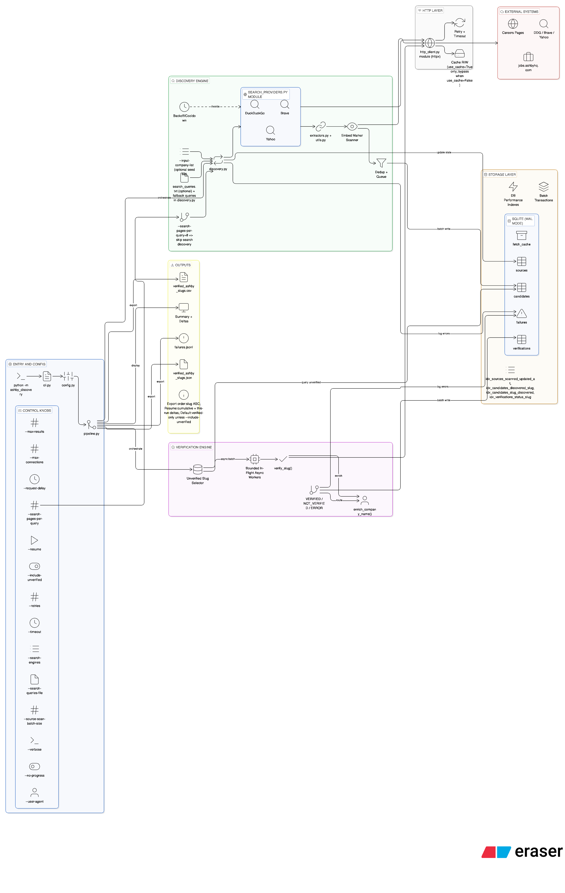

# 🏗️ Architecture

## 🎯 Purpose

This pipeline finds and verifies real Ashby slugs (`jobs.ashbyhq.com/{slug}`) using multiple discovery signals.

## 🖼️ In-Depth Diagram

Path: `docs/diagrams/in-depth-system-diagram.png`

## 🔄 End-to-End Flow

1. Parse CLI arguments and build runtime config.
2. Resolve SQLite path:
   - `--resume`: reuse existing DB
   - without `--resume`: create a timestamped DB if the default DB already exists
3. Run search discovery (unless `--search-pages-per-query 0`).
   - Search URL budget: `max_results * 4`
4. Insert direct slug candidates from `jobs.ashbyhq.com/...` URLs.
5. Queue non-Ashby pages as source pages for embed scanning.
6. Expand optional `--input-company-list` seeds into likely careers paths.
7. Scan source pages for Ashby embed markers and extract slugs.
8. Verify unverified slugs by requesting canonical board URL.
   - Verification budget: `max_results * verify_limit_multiplier` (default `4`)
9. Enrich verified rows with inferred company name.
10. Export CSV/JSON and write `failures.jsonl`.

## 🔎 Discovery Strategies

### 🌐 1) Direct Search Discovery

Search providers return URLs using queries from `search_queries.txt` (or fallback queries).

- If result URL is `jobs.ashbyhq.com/...`, extract slug directly.
- If result URL is external, enqueue for source scanning.

### 🧭 2) Embedded Careers Discovery

Source pages are fetched and scanned for markers including:

- `jobs.ashbyhq.com`
- `/embed?version=2`
- `__ashbyBaseJobBoardUrl`
- `window.Ashby` / `window.ashby`

URLs found in HTML/script attributes are parsed for slugs.

## 🧼 Slug Normalization Behavior

For Ashby URLs with deeper paths, only the first path segment is used as the slug.

Examples:

- `https://jobs.ashbyhq.com/openai/job/123` -> `openai`
- `https://jobs.ashbyhq.com/Checkbox%20Technology/jobs/backend` -> `Checkbox Technology`

This keeps one canonical board URL format: `https://jobs.ashbyhq.com/{slug}`.

## ✅ Verification Model

A slug is verified by requesting the canonical board URL and scoring page content:

- Ashby markers are present
- Strong error/challenge signals are not dominant
- HTTP status/content match expected board patterns

Status values:

- `VERIFIED`
- `NOT_VERIFIED`
- `ERROR`

## 🛡️ Reliability Controls

- Async HTTP with configurable timeout/retries/concurrency
- Request rate limiting
- Provider backoff and temporary disable after repeated blocks
- DuckDuckGo endpoint fallback per page (`html` -> `lite`)
- URL/slug dedup in SQLite
- Failure recording with stage and target
- Batched SQLite writes for high-volume pipeline stages
- Bounded in-flight verification workers to reduce scheduler/memory overhead

## 🔁 Resume and Idempotency

With `--resume`, the same DB keeps:

- already scanned source pages
- already discovered candidates
- already verified slugs
- cached fetches

This avoids duplicate work and lets interrupted runs continue safely.
